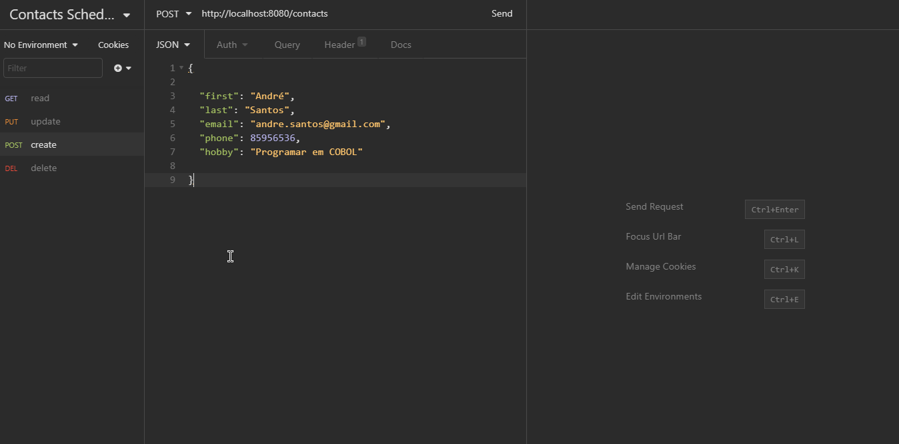

<h1 align="center" >
Contact Schedule!
</h1>

<strong>
Java with Spring Boot CRUD!
</strong>

This backend was made for the frontend struct in React js. See the repository <a href="https://github.com/mycatdoitbetter/schedule-frontend">here!</a>

  <a aria-label="Java" href="https://github.com/facebook/react/blob/master/CHANGELOG.md#16120-november-14-2019">
    </img>
  </a>
  <a aria-label="Spring Boot" href="https://www.typescriptlang.org">
    </img>
  </a>

